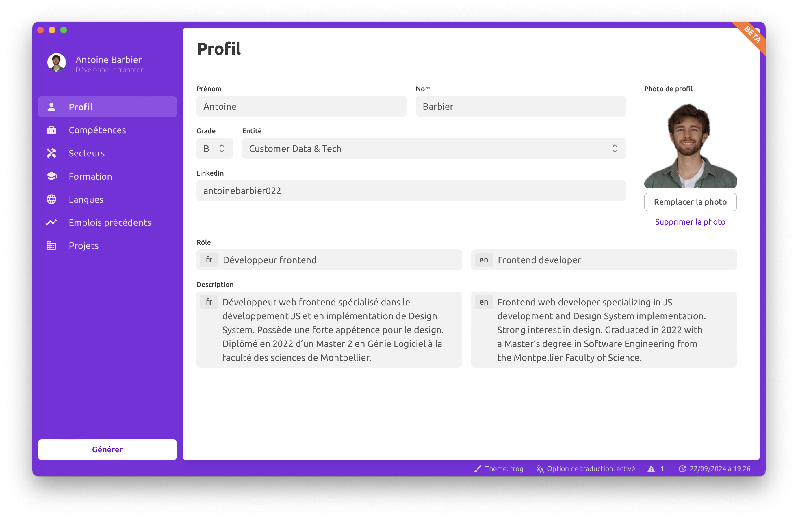

# CV generator

[](https://github.com/antoinebarbier022/frog-cv-generator-tauri/actions/workflows/main.yml)

**CV Generator** is a desktop application for generating CVs. Given a predefined template, the app populates it with user data and outputs a PPTX file.



## Technologies used

- **Tauri**: For building the desktop application with a lightweight and secure framework.
- **React**: For building the user interface with a modern, component-based approach.
- **Python**: For creating an API with FastAPI to manage PPTX files, with the Python script compiled into a binary.

## Installation

1. Install dependencies:

   ```bash
   npm install
   ```

2. Install Rust dependencies for Tauri:

   ```bash
   cd src-tauri
   cargo build
   cd ..
   ```

## Scripts

- **Development**:

  ```bash
  npm run dev
  ```

- **Build**:

  ```bash
  npm run build
  ```

- **Generate Types**:

  ```bash
  npm run generate_types
  ```

- **Release**:

  ```bash
  npm run release
  ```

- **Tauri Commands**: Run Tauri CLI commands for additional tasks.

  ```bash
  npm run tauri
  ```
